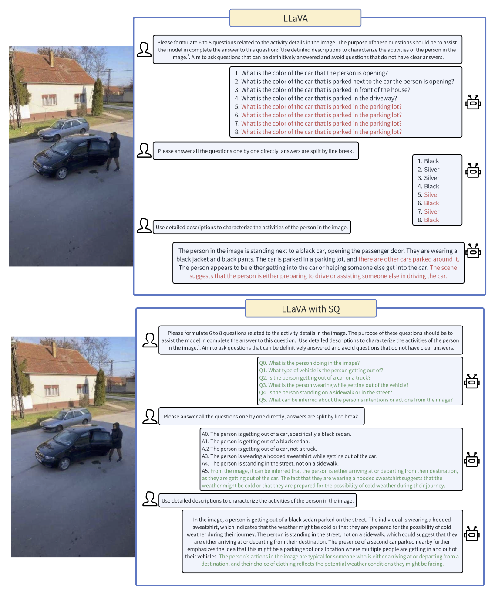

# Socratic Questioning: Learn to Self-guide Multimodal Reasoning in the Wild
---

This is the official completion of the paper: ["Socratic Questioning: Learn to Self-guide Multimodal Reasoning in the Wild."](https://arxiv.org/abs/2501.02964).

Our dataset is available at [CapQA](https://huggingface.co/datasets/wphu/CapQA).

<a href="./images/comparision_questions_gen.pdf">
  
</a>


## How to use

The training code in this repo may be out of date, you can use the latest code from [LLAVA](https://github.com/haotian-liu/LLaVA).

Please note that you need to replace the original `llava/mm_utils` with the new `llava/mm_utils` from this repository, as there are several newly added functions implementing our "Socratic Questioning" methodology.

The evaluation procedure is very much like that of [LLaVA](https://github.com/haotian-liu/LLaVA/blob/main/docs/Evaluation.md). Please download [eval.zip](https://drive.google.com/file/d/1atZSBBrAX54yYpxtVVW33zFvcnaHeFPy/view?usp=sharing) and unzip it under `./playground/data/`. 


## Weight

[sq-llava-v1.5-7b-lora](https://huggingface.co/wphu/sq-llava-v1.5-7b-lora/tree/main)


## Finetune

You may need to modify the `data_path`,`vision_tower`,`pretrain_mm_mlp_adapter`,`output_dir` with you own local path.

```
CUDA_VISIBLE_DEVICES=0,1,2,3,4,5,6,7 bash scripts/v1_5/finetune_lora_capQA.sh
```


## Evaluation
### ScienceQA

1. Under `./playground/data/eval/scienceqa`, download `images`, `pid_splits.json`, `problems.json` from the `data/scienceqa` folder of the ScienceQA [repo](https://github.com/lupantech/ScienceQA).
2. Single-GPU inference and evaluate.

Evaluating 1-Turn Inference
```Shell
CUDA_VISIBLE_DEVICES=0 bash scripts/v1_5/eval/sqa.sh
```
Evaluating 3-Turn Inference
```Shell
CUDA_VISIBLE_DEVICES=0 bash scripts/v1_5/eval/sqa_3turn.sh
```
### TextVQA

1. Download [`TextVQA_0.5.1_val.json`](https://dl.fbaipublicfiles.com/textvqa/data/TextVQA_0.5.1_val.json) and [images](https://dl.fbaipublicfiles.com/textvqa/images/train_val_images.zip) and extract to `./playground/data/eval/textvqa`.
2. Single-GPU inference and evaluate.

Evaluating 1-Turn Inference
```Shell
CUDA_VISIBLE_DEVICES=0 bash scripts/v1_5/eval/textvqa.sh
```

Evaluating 3-Turn Inference
```Shell
CUDA_VISIBLE_DEVICES=0 bash scripts/v1_5/eval/textvqa_3turn.sh
```
### MM-Vet

1. Extract [`mm-vet.zip`](https://github.com/yuweihao/MM-Vet/releases/download/v1/mm-vet.zip) to `./playground/data/eval/mmvet`.
2. Single-GPU inference.

Evaluating 1-Turn Inference
```Shell
CUDA_VISIBLE_DEVICES=0 bash scripts/v1_5/eval/mmvet.sh
```
Evaluating 3-Turn Inference
```Shell
CUDA_VISIBLE_DEVICES=0 bash scripts/v1_5/eval/mmvet_3turn.sh
```

3. Evaluate the predictions in `./playground/data/eval/mmvet/results` using the official jupyter notebook according to the instructions here [MM-Vet](https://github.com/yuweihao/MM-Vet).
